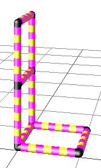
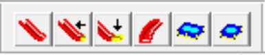

# 帮助手册

## 前言
本文介绍了Quadro汉化增强版程序，包括3个快速入门实例、所有的工具栏和菜单功能。主要内容翻译自Quadro官方建模程序的帮助手册`Quadro_Enu.hlp`，除此之外，也补充了汉化增强版所支持的快捷键，部分复杂功能通过GIF动图的形式进行演示。

如有任何疑问或建议，欢迎联系小红书@厉害啊小臭宝。

## 快速入门
###  最简单的 Quadro 模型：立方体
GIF动图演示：

安装成功后，第一个`Quadro.exe`程序启动，你会看到以下图像：

上部区域有菜单栏、工具栏，程序主要通过工具栏控制。要创建 Quadro 模型，首先要选择一个配件。如上图，按下了 35 厘米管的按钮，按下了颜色为“红色”的按钮。
通过在其中一条粉红色线条上单击鼠标左键放置所选配件。如果单击上图中鼠标指示的位置，则会得到一个水平管：

在管子的末端自动创建了一个新的粉红色“星形”线条。这些线指示可以向模型添加新管的所有位置。前面和后面的粉红色线条看不太清楚，为了能够更好地绘制立方体的底面，应该稍微转动图像。为此，请使用“视图和相机位置”工具栏中两个突出显示的按钮：

反复按右键，会得到如下显示：

现在可以通过单击粉红色的线条添加另外三个管子，轻松地搭建一个正方形。管之间的连接器是自动创建的。

如果插入或移除管子，连接器会自动更换，这非常的方便。可以试着将正方形扩展为立方体。这样，2通连接器自动更改为3通角连接器：

如果选择不同类型的配件，粉红色线条会发生变化，指示该配件可放的位置。接下来，在顶部添加一个面板，将立方体制作成一个凳子。首先在“标准配件”工具栏中点击如下图的方形面板的按钮：

连接器处的线条消失，管子现在显示为粉红色。单击其中两个管子，面板就会放置在这两个管子之间。首先点击以下一根管子：

这下只有6根管子显示为粉红色，它们都可以与第一个管子一起构成一个面。单击顶面3根管中的任意一个：

面板就出现了，所有管子再次显示为粉红色，以便可以继续放置其他面板：

要再次以正常的颜色显示模型，请选择不同的功能，例如按下“管”的按钮。

### 使用配件清单

GIF动图演示：

Quadro 设计软件的一个重要优势是，它会自动计算你使用的配件并将其与可用配件的数量进行比较。配件清单显示在一个特殊的窗口中，可以通过菜单项“窗口/配件清单”或快捷键Ctrl+Q打开。

各个列具有以下含义：
- 配件名：所用配件的准确描述
- 数量：当前模型中使用的配件数
- 编号＃：配件的 Quadro 编号
- 价格/个：加载的价目表提供的配件价格
- 总价格：单价乘以数量
- 可用：可用的配件数
- 剩余：尚未使用的配件数
- 缺少：缺少的配件数
- 成本：缺少的配件的成本

如果购买了多个套件，可以使用“导入/导出/加载配件清单”功能、“导入/导出/新增配件清单”将更多套件的配件清单添加到已加载的库存清单中，可以为每个套件重复此操作。零散购买的配件，可以用鼠标左键双击配件名时，会打开一个输入窗口，您可以在其中输入价格、编号和配件的可用数量：

如果您更新了配件清单，则应使用“保存配件清单”功能保存到新文件。程序会在启动时自动加载库存清单，自动加载最近加载的配件清单。（译者按：实测并不支持，还是得每次手动加载一下）

软件包含大多数 Quadro 套件的配件清单。这些文件的文件扩展名为“.qbl”，位于程序的安装目录中。（译者按：程序安装目录下的套件qbl文件已普遍太古老了，请从其他渠道获取最新的套件qbl文件）

还可以使用菜单项“导入/导出/导出配件清单”导出 CSV 文件格式的配件清单，将其写到 Excel。

通常只显示当前模型中使用的配件。使用菜单项“查看/查看全部”，您可以显示所有已知配件，这对于计算价格和清点库存尤为重要。（译者按：实测该功能有问题）

如果您的模型缺少某些配件，您可以使用菜单项“文件/打印...”打印出缺少配件的订单。将此配件清单信息发送给离您最近的经销商或分销商进行订购。

菜单“导入/导出”中剩下的两个功能，“加载价目表”和“保存价目表”功能用于加载价目表和保存更改后的价目表。
请注意，随程序提供的价目表（Pricelist zero.qpl）不包含任何价格。对于商业客户，可根据要求提供相应的价目表。私人客户的价格根据经销商的零售价而有所不同。该程序使用价目表中的编号，如果程序中使用了没有库存的配件，这种配件没有编号。（译者按：价目表没用，为避免汉化加强版每次开启时提示错误，加载一个空的qbl文件后就不会再提示了）

### 斜坡、滑道和旋转
GIF动图演示：

通常，建筑元素彼此成直角放置在一起。然而，有几种方法可以将元素以任意角度放在一起。一种方法是轴承连接器。 如以下梯子示例，轴承连接器可以滑过管子并自由转动：

首先用黄色管子绘制框架。

然后使用专业工具栏的轴承连接器。为了能够将带环的轴承连接器放在管子上，还要按下按钮。现在用鼠标左键单击轴承连接器，顶端有 4 个粉红色环的位置可以放。放置后，每按一下鼠标右键，就会转动90度的轴承连接器。旋转角度是在程序中是相对于水平线测量的，因此应该将轴承连接器的接头转动到水平位置，即最接近所需位置的位置。

要将轴承连接器转到正确的位置，请打开轴承连接器的属性窗口。为此，请在编辑/标准功能工具栏先使用选择功能。在其中一个轴承连接器上双击鼠标左键，就可以打开属性窗口。移动窗口，以便您可以看到连接器。

现在使用“倾斜”按钮打开输入窗口“斜坡/滑道/旋转。

有两种模型：有些模型本身是直角的，但相对于地面不是直角的，这种请选择“完整模型倾斜”；在当前的案例中，模型的基本部分与地面成直角，只有梯子是倾斜的，因此请选择“仅斜坡倾斜”。
选择的方向是相对正视图而言，因此选择代表向下旋转的“Y-”。
梯子应为 2 个单位 = 80 厘米高， 1 个单位 = 40 厘米宽。因此，从右上区域的列表中选择 h = 80 cm 和 t = 40 cm ，会自动复制到右下区域的输入字段中，也可以在“h”和“t”输入字段前打勾并直接输入值。

可以继续使用选择功能以相同的方式转动其他三个轴承连接器。如果转动多个连接器，则有一种更快的方法，通过点击更改角度功能（在舒适功能工具栏中的按钮），直接打开“倾斜/滑道/旋转”窗口。
现在如下图所示转动所有四个连接器：

如果其中一个连接器角度错了 90 度，您可以选择该连接器，然后用鼠标右键以相同的方式旋转它。正确转动所有连接器后，用 15 厘米和 25 厘米的管子绘制梯子。

如果两个相对的轴承连接器之间用管子贯通了，图像上管子会可能稍微移动一点。因为在具有倾斜构造元素的模型中，这些元素通常在数学上并不那么精准。如果“自动位置校正”功能（舒适功能工具栏的按钮）被激活，（默认情况下）管的长度会自动调整以消除小间隙。使用选择功能鼠标左键双击打开其中一个管的属性窗口，就能看到校正值。

在本例中，校正量几乎为 4 毫米。由于计算大型模型的位置校正可能需要一段时间，因此仅对倾斜配件进行计算。程序会自动确定配件是否需要位置校正。校正值也显示在属性窗口中，可以在那里手动更改。

另一个示例是以下斜坡：

首先画出黄色部分，然后转动连接斜坡的两个连接器，选择 h = 40 厘米，l = 80 厘米。

## 最重要的工具栏
### 编辑/标准功能

该工具栏包含最重要的处理功能，因此应始终显示。

- 新建
- 打开
- 保存
- 保存图像
- 在默认打印机上打印图像
- 剪切
- 复制
- 粘贴
- 删除
- 撤消
- 重做
- 选择
- 删除特定元素
- 显示/隐藏标准配件
- 显示/隐藏颜色选择
- 显示/隐藏视图和相机位置
- 显示/隐藏游乐配件
- 显示/隐藏纺织品
- 显示/隐藏木制家具配件
- 显示/隐藏轮子
- 显示/隐藏舒适功能
- 显示/隐藏专业配件
- 显示/隐藏特殊面板
- 显示/隐藏查看大型物体
- 显示/隐藏选择和移动

` “新建”`

创建新文档
工具栏：“编辑/标准功能”
菜单项：文件/新建
快捷键：Ctrl+N

` “打开”`

在新窗口中打开一个文档。可以同时打开多个，并可在多个打开的文档之间切换。
工具栏：“编辑/标准功能”
菜单项：文件/打开...
快捷键：Ctrl+O

` “保存”`

将当前打开的 Quadro 设计文件保存在软盘或硬盘上。如果文件还没有任何名称，系统会要求您为文件命名。
工具栏：“编辑/标准功能”
菜单项：文件/保存
快捷键：Ctrl+S

` “保存图像”`
将模型图像另存为具有可选分辨率的 Windows 位图图像文件(.BMP)。
工具栏：“编辑/标准功能”

` “在默认打印机上打印图像”`

在默认打印机上打印模型的图片。如果你想使用另一台打印机，你必须使用菜单项文件/打印。
工具栏：“编辑/标准功能”

` “剪切”`

将选定的元素传输到 Windows 剪贴板并将它们从当前模型中删除。使用此功能，您可以将模型的一部分从一个 Quadro 设计文件传输到另一个 Quadro 设计文件。要选择元素，请使用工具栏“选择和移动”中的功能。您还会在那里找到用于在模型中移动元素的功能。
工具栏：“编辑/标准功能”
菜单项：编辑/剪切
快捷键：Ctrl+X

` “复制”`

将选定的元素传输到 Windows 剪贴板而不将它们从当前模型中删除。使用此功能，您可以将模型的一部分从一个 Quadro 设计文件传输到另一个 Quadro 设计文件。要选择元素，请使用工具栏“选择和”中的功能。您还会在那里找到用于在模型中复制元素的函数。
工具栏：“编辑/标准功能”
菜单项：编辑/复制
快捷键：Ctrl+C

`“粘贴”`

将剪贴板的内容插入到当前模型中。您可以使用“剪切”和“复制”功能将模型的一部分传输到剪贴板。
工具栏：“编辑/标准功能”
菜单项：编辑/粘贴
快捷键：Ctrl+V

` “删除”`

删除所有选定的元素。这些元素不会复制到 Windows 剪贴板中。
工具栏：“编辑/标准功能”
菜单项：编辑/删除
快捷键：Del

`“撤消”`

撤消上一个操作。可以使用这个功能来撤销若干个步骤。即使在保存和加载文件后，撤消信息也保持不变。如果要删除所有的撤销信息，使用菜单项“编辑/删除撤消”。
工具栏：“编辑/标准功能”
菜单项：编辑/撤消
快捷键：Ctrl+Z

` “重做”`

恢复上一个已撤销的操作。
工具栏：“编辑/标准功能”
菜单项：编辑/重做
快捷键：Ctrl+Y

` “选择”`

使用选择功能可以选择单个元素。所选元素显示为浅蓝色,所选元素的类型显示在左侧下方的状态行中，当无法看清连接器类型时，就很有用。

如果用鼠标左键双击选定的元素，大多数元素都会打开一个小的属性窗口。这个窗口在一个管子上看起来如下：

基本上可以在此处调整配件的尺寸和表面。字段“校正”和“位置校正”是必需的，因为有时对角的管在现实中并不完全适合，程序必须稍微调整长度以避免有间隙。
如果在选择的时候按住shift键，可以选择多个元素。
如果在选择时按住 control 键，则所选元素将取消选择，而未选中的元素将变为选中状态。
工具栏：“编辑/标准功能”、“选择和移动”

`“删除特定元素”`

使用此功能，可以删除单个元素，而无需事先选择它们。选择此功能，然后用鼠标左键单击要删除的元素。不应该删除连接器，因为连接器是由程序自动创建、修改和删除的。因此，在删除连接器之前会警告您：

工具栏：“编辑/标准功能”
快捷键：D

`“显示/隐藏标准配件”`

显示或删除工具栏“标准配件”。
工具栏：“编辑/标准功能”
菜单项：查看/工具栏/标准配件

`“显示/隐藏颜色选择”`

显示或删除工具栏“颜色选择”。
工具栏：“编辑/标准功能”
菜单项：视图/工具栏/颜色选择

 `“显示/隐藏视图和相机位置”`

显示或删除工具栏“视图和相机位置”。
工具栏：“编辑/标准功能”
菜单项：视图/工具栏/视图和相机位置

`“显示/隐藏游乐配件”`

显示或删除工具栏“游乐配件”。
工具栏：“编辑/标准功能”
菜单项：查看/工具栏/游乐配件

`“显示/隐藏纺织品”`

显示或隐藏工具栏“纺织品”。
工具栏：“编辑/标准功能”

`“显示/隐藏木制家具配件”`

显示或删除工具栏“木制家具配件”。
工具栏：“编辑/标准功能”
菜单项：查看 / 工具栏 / 木制家具配件

`“显示/隐藏轮子”`

显示或删除工具栏“轮子”。
工具栏：“编辑/标准功能”
菜单项：查看/工具栏/轮子

`“显示/隐藏舒适功能”`

显示或删除工具栏“舒适功能”。
工具栏：“编辑/标准功能”
菜单项：查看/工具栏/舒适功能

`“显示/隐藏专业配件”`

显示或删除工具栏“专业配件”。
工具栏：“编辑/标准功能”
菜单项：查看/工具栏/专业配件

`“显示/隐藏特殊面板`

显示或删除工具栏“特殊面板”。
工具栏：“编辑/标准功能”
菜单项：视图/工具栏/特殊面板

`“显示/隐藏查看大型物体”`

显示或删除工具栏“查看大型物体”。
工具栏：“编辑/标准功能”
菜单项：查看/工具栏/查看大型物体

`“显示/隐藏选择和移动”`

显示或删除工具栏“选择和移动”。
工具栏：“编辑/标准功能”
菜单项：查看/工具栏/选择和移动

### 标准配件

“标准配件”工具栏包含 Quadro 套件中最常用的 Quadro 配件。

- 10cm管
- 15cm管
- 25cm管
- 35cm管
- 75cm管
- ?cm 管
- 弯管
- 弯管
- 弯管
- 35/40cm面板
- 25/30cm面板
- 15/20cm面板
- 椅背
- 45度连接器
- 45度连接器
- 45度连接器
- 起始点

`“10cm管”`

由于 10 厘米的管子很少使用，因此该按钮中的文本为灰色。您可以使用按钮选择管子的颜色。
工具栏：“标准配件”

`“15cm管”`

如果您使用 15 厘米的管子，请考虑到儿童的头部可能会卡在相距 15 厘米的两根管子之间。您不应在儿童脚踩不到地的高度这样放置管子，因为孩子在玩耍时可能会卡住自己。如果无法避免此类开口，必须用小面板将其封闭。工具栏“舒适功能”中有“卡头检查”功能，会自动搜索您的模型查找是否有卡住头部的危险地方，并将这些地方标记为浅蓝色。
工具栏：“标准配件”
快捷键：1

`“25cm管”`

由于 25 厘米的管子很少使用，因此此按钮中的文本为灰色。您可以使用按钮选择管子的颜色。
工具栏：“标准配件”
快捷键：2

`“35cm管”`

35 厘米是最常用的管长。两个 15 厘米的管子也产生 35 厘米的连接器。两个 35 厘米的管产生 75 厘米的连接器。您可以使用按钮选择管子的颜色。
工具栏：“标准配件”
快捷键：3或Escape

`“75cm管”`

您可以使用按钮选择管子的颜色。
工具栏：“标准配件”
快捷键：7

`“?cm管”`

系统会您输入所需的长度生成管。该功能主要是为展台和陈列搭建提供的。当然，您可以使用任意管长设计纯虚拟的“自由风格”Quadro 模型。
工具栏：“标准配件”

`“弯管”`

由于弯曲管有多种放置可能性，因此有三个按钮。可以先将模型转到一个角度，获得更好的空间感，再放置弯管。
工具栏：“标准配件”
快捷键：8

`“弯管”`

同上。
工具栏：“标准配件”
快捷键：9

`“弯管”`

同上。
工具栏：“标准配件”
快捷键：0

`“35/40cm面板”`

为了能够搭建面板，首先您必须构建一个管架。对于 40 厘米的面板，您需要一个 35 厘米的管子框架。虽然每个面板都应该有一个完整的框架，但也可以在两个管子之间放置一个面板。通过在两个管子上分别单击一次，将面板放置在这两个管子之间。
如果你想把图像放在面板上（详见工具栏“颜色选择”的“颜色/材质”），你应该注意，你点击的第一个管，是图像的底边。
放置面板后，可以使用鼠标右键翻转面板。
工具栏：“标准配件”
快捷键：P

`“25/30cm面板”`

同上。
工具栏：“标准配件”

`“15/20cm面板”`

同上。
工具栏：“标准配件”

`“椅背”`

放置儿童椅的靠背。首先，您必须将两根 15厘米 的管子平行放置，相距 30厘米（中间放置 25厘米 的管子）。然后依次点击两个15厘米的管子放置靠背。通常一个5厘米 柔性连接器栓塞和一个管帽会被放置在每个 15厘米 的管道一端。
工具栏：“标准配件”、“木制家具配件”

`“45度连接器”`

由于45度连接器有多种放置可能性，因此有三个按钮 。第一个45 度连接器可以与其他连接器水平相连，如果不想让另一端倾斜管段朝上，则应在放置后用鼠标右键将连接器旋转到正确的位置。
工具栏：“标准配件”
快捷键：4

`“45度连接器”`

同上。使用此按钮，可以放置一段垂直管段的 45 度连接器。放置后，您可以使用鼠标右键将另一端倾斜管段旋转到正确的位置。
工具栏：“标准配件”
快捷键：5

`“45度连接器”`

同上。这种45度连接器的两端都可以与管直接连接，另外两种45度连接器只有一端可以与管直接连接，另一端要连接其他连接器。
工具栏：“标准配件”
快捷键：6

`“起始点”`

有了这个功能，新的“起始点”可以以 20 厘米的网格放置在地面上。这个功能对于一开始在地面上标记出想要的模型尺寸也是相当有用的。
工具栏：“标准配件”

### 颜色选择

您可以使用工具栏“颜色选择”为接下来创建的元素设置颜色。黑色和白色包含在工具栏“特殊面板”中。
- 红色
- 绿色
- 蓝色
- 黄色
- 颜色/材质

GIF动图演示：

`“红色”`

配件有多种颜色可供选择（管、面板和多轮），此为选择红色为颜色。管和面板/轮子的颜色是单独选择的。您应该首先选择配件类型，然后选择颜色，而不是相反，否则您会为错误的配件类型选择颜色。
工具栏：“颜色”
快捷键：R

`“绿色”`

选择绿色作为颜色。
工具栏：“颜色”
快捷键：G

`“蓝色”`

选择蓝色作为颜色。
工具栏：“颜色”
快捷键：B

`“黄色”`

选择黄色作为颜色。
工具栏：“颜色”
快捷键：Y

`“颜色/材料”`

显示“表面选择”弹出窗口。可以在此处定义任意颜色，甚至可以用图像覆盖面板和管子。

 

对于每种配件，可以选择一种当前标准颜色。对于面板和管子，可以直接通过按钮选择颜色。对于仅提供一种颜色的其他配件，如连接器、滑梯或多轮锁，您只能在此处选择颜色。在右上角区域的“Selection for”中，可以设置颜色用于哪种配件。

在 3D 程序中，颜色不仅仅是原色的混合，还包含反射特性，但在管状和面板状配件上反射特性有所不同。使用“To be used for”的选择类型，例如管、面板、连接器或滑梯。
在“光与阴影”下，您可以分别为内部和外部定义反射属性。面板的内部和外部通常具有相同的反射特性。相比之下，管子内部的“漫射光”和“镜面光”滑块设置为 0。通过调节“环境光”，您可以调整环境光的亮度。环境光在四面八方可见，即使是与光源背面，也同样明亮。“漫射光”是指光源漫反射的光，漫射光仅在面对光源的一侧可见，并且显示物体的颜色（例如红色）。“镜面光”，物体表面被强烈反射并显示光源的颜色（白色），通过调节“光泽度”，您可以调整反射的锐度，表面越光滑，反射越锐利。

您可以在“图像/纹理”下用图像覆盖表面，选择一个 Windows 位图文件（.BMP）。必须使用菜单项“查看/编辑 3D 图像质量...”或“查看/照片 3D 图像质量...”激活纹理映射。注意，在用图像覆盖元素之前，应该使用“新建”按钮创建并命名一个新的材质类型。下图显示了一个立方体，其管子已被条形纹理图像覆盖：

在下部区域，可以选择其他颜色。使用“Selection...”
按钮，会打开另一个颜色选择窗口：
 
工具栏：“颜色”

### 视图和相机位置

使用工具栏“视图和相机位置”，您可以旋转模型。通过头部和脚部的六个按钮，可以快速切换前、后、左、右、上、下视图。使用其他按钮可以将模型旋转 5 度。
- 从正面
- 从左面
- 从背面
- 从右面
- 从上面
- 从下面
- 向右转
- 向左转
- 向上转
- 向下转

GIF动图演示（包含“查看大型物体”部分功能）：

`“从前面”`

从正面看模型。
工具栏：“视图和相机位置”

`“从左面”`

从左面看模型。
工具栏：“视图和相机位置”

`“从背面”`

从背面看模型。
工具栏：“视图和相机位置”

`“从右面”`

从右面看模型。
工具栏：“视图和相机位置”

`“从上面”`

从上面看模型。
工具栏：“视图和相机位置”

`“从下面”`

从下面查看模型。
工具栏：“视图和相机位置”

`“向右转”`

模型向右旋转 5 度。
工具栏：“视图和相机位置”
快捷键：J

`“向左转”`

模型向左旋转 5 度。
工具栏：“视图和相机位置”
快捷键：L

`“向上转”`

模型向上旋转 5 度。
工具栏：“视图和相机位置”
快捷键：I

`“向下转”`

该模型向下旋转 5 度。
工具栏：“视图和相机位置”
快捷键：K

## 特殊配件工具栏

### 游乐配件

工具栏中的“游乐配件”包含滑梯等特殊游戏配件。
- 整合式滑梯
- 直滑梯
- 滑梯尾部
- 弧形滑梯
- 大游泳池
- 小游泳池

GIF动图演示：

`“整合式滑梯”`

整合式滑梯不需要连接滑梯尾部或另一个滑梯（双滑梯）。要放置滑梯，您必须单击 35 厘米的管子，滑梯的底部固定在该管子上。如果滑梯方向错误，请单击鼠标右键将其翻转。
工具栏：“游乐配件”

`“直滑梯”`

直滑梯应该连接滑梯尾部或另一个滑梯（双滑梯）。要放置滑梯，您必须单击 35 厘米的管子，滑梯的顶部固定在该管子上。如果滑梯方向错误，请单击鼠标右键将其翻转。
工具栏：“游乐配件”

`“滑梯尾部”`

滑梯尾部是直滑梯或弧形滑梯的尾部。
工具栏：“游乐配件”

`“弧形滑梯”`

弧形滑梯应该连接滑梯尾部或另一个滑梯（双滑梯）。要放置滑梯，您必须单击 35 厘米的管子，滑梯的顶部固定在该管子上。如果滑梯方向错误，请单击鼠标右键将其翻转。
工具栏：“游乐配件”

`“大游泳池”`

首先为游泳池画一个框架，如下图所示。
 

然后用鼠标左键单击图中标有绿色箭头的管子之一。如果水池放置在错误的一侧，请按鼠标右键将水池转过来。
工具栏：“游乐配件”

`“小游泳池”`

放置游泳池的方式像放“滑梯”一样，也是通过单击 35 厘米的管子。首先为游泳池画一个框架，如下图所示。

然后用鼠标左键单击图中标有绿色箭头的管子之一。如果水池放置在错误的一侧，请按鼠标右键将水池转过来。
工具栏：“游乐配件”

### 木制家具配件

工具栏“木制家具配件”包含将 Quadro 增强为家具的配件。
- 35cm木板
- 75cm木板
- 35cm带旋钮的木板
- 75cm带旋钮的木板
- 圆形木板
- 木制床架
- 椅背
- 管帽
- 5cm柔性连接器螺栓

译者按：该系列的配件从官方基本买不到了。

`“35cm木板”`

木板像塑料的面板一样放置，主要用于家具的构造。
工具栏：“木制家具配件”

`“75cm木板”`

75 厘米的木板可以放在由两个 75 厘米的管子和两个 35 厘米的管子组成的矩形框架上，主要用于家具的构造。
工具栏：“木制家具配件”

`“35cm带旋钮的木板”`

带按钮的木板与 Quadro 家具一起搭配，形成门。
工具栏：“木制家具配件”

`“75cm带旋钮的木板”`

75 厘米的木板可以放在由两个 75 厘米的管子和两个 35 厘米的管子组成的矩形框架上。带按钮的木板与 Quadro 家具一起搭配，形成门。
工具栏：“木制家具配件”

`“圆形木板”`

圆形木板可以放在由两个 35 厘米管和一个弯管组成的框架上，主要用于家具的构造。
工具栏：“木制家具配件”

`“木质床架”`

床架可以放在由两个 75 厘米管和两个 35 厘米管组成的矩形框架上。它被用于建造 Quadro 婴儿床的侧格栅。
工具栏：“木制家具配件”

`“椅背”`

放置儿童椅的靠背。首先，您必须将两根 15厘米 的管子平行放置，相距 30厘米（中间放置 25厘米 的管子）。然后依次点击两个15厘米的管子放置靠背。通常一个5厘米 柔性连接器栓塞和一个管帽会被放置在每个 15厘米 的管道一端。
工具栏：“标准配件”、“木制家具配件”

`“管帽”`

管帽用于封闭管子的端孔，例如用于作杠杆的管子不需要连·接到连接器。
工具栏：“木制家具配件”、“专业配件”

`“5cm柔性连接器螺栓”`

用于在开口管端固定面板。
工具栏：“木制家具配件”

### 纺织品

该工具栏包含各种房顶和布片。
- 房顶
- 大房顶
- 布片
- 圆形布片
- 布兜

GIF动图演示：

`“房顶”`

通过单击房顶脊上的 75 厘米管子来放置房顶。首先为房顶绘制如下图所示的框架。

然后用鼠标左键单击图中标有绿色箭头的管子。如果房顶放置错误，请多次按鼠标右键，直到房顶显示正确。
工具栏：“纺织品”

`“大房顶”`

通过单击房顶脊上的 75 厘米管子来放置房顶。首先为房顶绘制如下图所示的框架。

 

房顶的角落使用柔性连接器和柔性螺栓。在放置房顶的对角管时，必须打开舒适功能工具栏的“将自定定位的捕捉范围扩大到15cm”按钮。绿色管为55厘米长的特殊管。现在用鼠标左键单击图中用绿色箭头标记的管子。如果房顶放置错误，请多次按鼠标右键，直到房顶显示正确。
工具栏：“纺织品”

`“布片”`

纺织品的缝制方式使其可以套在两个平行的管子上。使用该功能，可以将布片放在两个直管上。默认放置75*35的布片，放置后用“选择”功能双击可更改尺寸。也可以使用特殊面板工具栏的“特殊面板”按钮，先调整所需尺寸再放置布片。
工具栏：“纺织品”

`“圆形布片”`

纺织品的缝制方式使其可以套在两个平行的管子上。使用该功能，可以将布片放在两个弯管上，是通过单击其中一个弯曲的管子放置的、放置后，您可以通过按鼠标右键将其转到所需位置。
工具栏：“纺织品”

`“布兜”`

在放置袋子之前，您必须创建一个由 4 个 35 厘米管子组成的正方形。通过点击其中一根管子来放置布兜。要将布兜旋转到正确的位置，请单击鼠标右键。
工具栏：“纺织品”

### 轮子

“轮子”工具栏包含Mobile扩展套件中的轮子和轴承配件。
- 多轮轴承
- 多轮（窄）
- 多轮锁
- 轴承连接器
- 在连接器上放轴承连接器/孔连接器
- 在管上放轴承连接器
- 越野轮（宽）
- 越野轮锁   
- 脚轮

GIF动图演示：

`“多轮轴承”`

可以直接在管子上组装多轮。更常见的是在连接器接头上组装，在连接器接头上组装多轮之前，必须先组装多轮轴承。多轮轴承用于将连接器接头的直径延伸到多轮的内径。
工具栏：“轮子”

`“多轮（窄）”`

可以直接在管子上组装多轮。更常见的是在连接器接头上组装，在连接器接头上组装多轮之前，必须先组装多轮轴承，并且多轮必须用多轮锁锁定。
工具栏：“轮子”

`“多轮锁”`

多轮锁用于固定多轮、孔连接器、越野轮锁（为了避免越野轮松动，应该安装越野轮锁，同时将多轮锁从外插入越野轮锁的孔中）。
工具栏：“轮子”、“专业配件”

`“轴承连接器”`

轴承连接器有管段和环，其他管可以穿过这个环。在 75 厘米管的两端可以组装两个越野轮。由于通过环插入的管子可以转动和移动，因此该连接器适用于许多活动模型，例如秋千、带曲柄的绞盘或在两个管子上移动的手推车。
有两放置方式，一是“在连接器上放轴承连接器/孔连接器”，即轴承连接器的管段连接在现有连接器的接头，二是“在管上放轴承接连接器”，即轴承连接器的环套在现有管子上。在这两种情况下，可以在放置后使用鼠标右键以 90 度的步长将连接器旋转到正确的位置。
工具栏：“轮子”、“专业配件”

`“在连接器上放轴承连接器/孔连接器”`

为孔连接器或轴承连接器选择放置模式。如果按下此按钮，轴承连接器的管段或者孔连接器的环段将连接到现有连接器的接头上。
工具栏：“轮子”、“专业配件”

`“在管上放轴承接连接器”`

为轴承连接器选择放置模式。如果按下此按钮，轴承连接器的环段将套在现有的管子。
工具栏：“轮子”、“专业配件”

`“越野轮（宽）”`

越野轮宽 15 厘米，因此只能安装在管子上。如果在管端安装越野轮，必须用越野轮锁固定，并用多轮锁锁住越野轮锁。（译者按：Quadro最新已没有要求多轮锁；为了更好的理解，本文将float wheel翻译成越野轮，将hub cap翻译成越野轮锁）
工具栏：“轮子”

`“越野轮锁”`

越野轮锁在管端用于固定越野轮。
工具栏：“轮子”

`“脚轮”`

选择“脚轮”作为配件类型。
工具栏：“轮子”

## 安全实用的工具栏
### 舒适功能

工具栏“舒适功能”没有配件，而是包含一些快捷操作和安全检查等的特殊功能。
- 更改角度
- 更改颜色
- 为多个配件分配相同的颜色
- 自动位置校正
- 将自动位置校正的捕捉范围扩大到15cm
- 分解视图
- 重叠检查
- 卡头检查
- 仅显示选定元素
- 模型可攀爬的最大高度

GIF动图演示：

`“更改角度”`

打开自由更改连接器放置角度的输入窗口。使用此功能，您可以绘制倾斜的斜坡、滑梯和梯子。阅读教程“斜坡、滑梯和旋转”可获取更多信息。
工具栏：“舒适功能”

`“更改颜色”`

可以直接调用输入窗口来设置配件的颜色和材质属性。而一般的方法要先使用选择功能选中配件，会更加耗时，特别是想要编辑多个配件的颜色时。
工具栏：“舒适功能”

`“为多个配件分配相同的颜色”`

类似“编辑颜色”功能，此功能可以快速改变配件的颜色。首先选择一种颜色，然后通过单击鼠标将其一个接一个地分配给多个配件。
工具栏：“舒适功能”

`“自动位置校正”`

如果按下此按钮，则会激活自动位置校正。在包含对角线和倾斜配件的模型中，配件并不总是完美地结合在一起。在真实模型中，这几乎不是问题，因为管子很容易弯曲 1 厘米或 2 厘米。为了在程序中模仿这种灵活性，程序稍微改变了管的长度以获得没有间隙的模型。实际上，改变的是角度而不是管的长度，但这计算起来会很复杂，而且程序会变得很慢。在具有大型连接倾斜结构的模型中，使用此方法计算也会持续很长时间。因此编辑时，您可以先关闭此功能，完成编辑后，再次打开此功能，则倾斜部分会自动进行位置校正。
工具栏：“舒适功能”

`“将自动位置校正的捕捉范围扩大到15cm”`

当管端之间的距离太大时，没有自动创建连接器时，则应使用此功能。除了这种情况，大多数时候都应关闭此功能。
工具栏：“舒适功能”

`“分解视图”`

模型将显示为分解视图。也可以在此视图中处理模型，并随时在正常视图和分解视图之间切换。在分解视图中工作会更容易，特别是对于非常密集的模型。
也可以使用工具栏“选择和移动”的功能手动创建分解视图。
工具栏：“舒适功能”

`“重叠检查”`

程序允许输入具有例如两个管交叉的模型，当然这在现实中是不可能的。使用此功能，您可以检查配件是否有不合理的重叠交叉。如有，冲突的配件标记为浅蓝色。通过“仅显示选定元素”功能，可以隐藏所有未选定的配件，以便能够更好地查看选定的配件。
工具栏：“舒适功能”

`“卡头检查”`

如果您使用 15 厘米的管子，请考虑到儿童的头部可能会卡在相距 15 厘米的两根管子之间。您不应在儿童脚踩不到地的高度这样放置管子，因为孩子在玩耍时可能会卡住自己。如果无法避免此类开口，必须用小面板将其封闭。此功能会自动搜索您的模型查找是否有卡住头部的危险地方，并将这些地方标记为浅蓝色。通过“仅显示选定元素”功能，可以隐藏所有未选定的配件，以便能够更好地查看选定的配件。
工具栏：“舒适功能”

`“仅显示选定元素”`

仅显示选定的元素（浅蓝色）。此功能与检查功能结合使用，可以更好地查看检查结果。
工具栏：“舒适功能”

`“模型可攀爬的最大高度”`

模型的可攀爬高度不能超过其长和宽（译者按：主要考虑重心问题）。此功能将确定长度和宽度两个值中较小的值标记为最大高度。
工具栏：“舒适功能”

## 高级进阶的工具栏

### 专业配件

“专业配件”工具栏包含更稀有的配件，需要另外购买。

- 套筒（适配器）
- 管帽
- 突出连接器接头
- 多轮锁
- 轴承连接器
- 孔连接器
- 2路孔连接器
- T型孔连接器
- 旋转的T型孔连接器
- 第1个柔性连接器铰链
- 第2个柔性连接器铰链
- 在连接器上放孔连接器/轴承连接器
- 在管上放孔连接器
- 在管上放轴承连接器
- 15cm柔性连接器螺栓
- 5cm柔性连接器螺栓
- 双管连接器
- 管夹
- 60cm铝管
- 80cm铝管
- 铝管连接器

GIF动图演示：

`“套筒（适配器）”`

套筒（适配器）用于插入脚轮或者将 Quadro 模型固定在墙上等类似位置。也可以使用它们来覆盖突出的连接器接头。本程序在放置脚轮时会自动放置套筒（适配器），因此不需要先放套筒（适配器）再放脚轮。
工具栏：“专业配件”

`“管帽”`

管帽用于封闭管子的端孔，例如不需要连接到连接器用作杠杆的管子。
工具栏：“木制家具配件”、“专业配件”

`“突出连接器接头”`

该程序会根据连接的管自动创建连接器。当想使用带有开放接头的连接器时，请使用此功能。先点下按钮，再点击连接器的任一红线方向，就会在该方向增加一个突出的连接器接头。
工具栏：“专业配件”

`“多轮锁”`

多轮锁用于固定多轮、孔连接器、越野轮锁（为了避免越野轮松动，应该安装越野轮锁，同时将多轮锁从外插入越野轮锁的孔中）。
工具栏：“轮子”、“专业配件”

`“轴承连接器”`

轴承连接器有管段和环段，管段连接其他连接器，环段套住其他管子。在 75 厘米管的两端可以组装两个越野轮。由于通过环插入的管子可以转动和移动，因此该连接器适用于许多活动模型，例如秋千、带曲柄的绞盘或在两个管子上移动的手推车。
有两放置方式，一是“在连接器上放轴承连接器/孔连接器”，即轴承连接器的管段连接在现有连接器的接头，二是“在管上放轴承接连接器”，即轴承连接器的环套在现有管子上。在这两种情况下，可以在放置后使用鼠标右键以 90 度的步长将连接器旋转到正确的位置。
工具栏：“轮子”、“专业配件”

`“孔连接器”`

孔连接器具有接头段和环段，接头段连接其他管子，环段套住其他连接器。使用孔连接器，可以将管和连接器垂直连接在一起。由于环段可以转动，因此孔连接器也适用于搭建转向杠杆模型。此外，最多可将三个管子与孔连接器（即T型孔连接器）连接，这样你就可以搭建一个秋千或车的座椅。
通常，可以用多轮锁固定孔连接器。
如果按下“在连接器上放轴承连接器/孔连接器”按钮，孔连接器的环就会套在连接器的接头上。如果按下“在管上放孔连接器”按钮，孔连接器的接头段就会连上管子。在这两种情况下，你都可以放置孔连接器后使用鼠标右键以 90 度的步长，将连接器旋转到正确的位置。
请注意，如果通过“在管上放孔连接器”将孔连接器连上管后，孔连接器的环的两侧是不一样的，一侧有一个新的星形，另一侧应该连接多轮锁。
如果想自由转动而不是90度选择孔连接器，您可以使用工具栏“舒适功能”的“更改角度”，也可以按下工具栏“编辑/标准功能”的“选择”，然后用鼠标左键双击该孔连接器以打开其属性窗口，在其中按“倾斜”按钮。
工具栏：“专业配件”

`“2路孔连接器”`

参考“孔连接器”。（译者按：该配件从官方基本买不到了）
工具栏：“专业配件”

`“T型孔连接器”`

参考“孔连接器”。
对比还有一个“旋转的T型孔连接器”按钮。如果按下“在连接器上放轴承连接器/孔连接器”按钮，则孔连接器与其环上的连接器接头会同时放置，“T型孔连接器”和“旋转的T型孔连接器”的效果几乎一样，因为放置后可以用鼠标右键再旋转。如果按下“在管上放孔连接器”按钮，“T型孔连接器”会将中间的接头放入管中，而“旋转的T型孔连接器”会将旁边的接头放入管中。
工具栏：“专业配件”

`“旋转的T型孔连接器”`

参考“T型孔连接器”。
工具栏：“专业配件”

`“第1个柔性连接器铰链”`

柔性连接器由三部分组成，两个相同的柔性连接器铰链和一个柔性连接器螺栓。
可以像孔连接器一样使用柔性连接器铰链。然而，柔性连接器铰链的环是被切开的，使得两个柔性连接器铰链可以装配在一个连接器接头上。两个柔性连接器铰链连接成一个2路孔连接器，但角度更加灵活。
可以将两个柔性连接器铰链套进普通连接器接头或柔性连接器螺栓上。再将柔性连接器螺栓可以滑入管子5厘米深或10厘米深处，使得柔性连接器铰链位于中间或底端，形成更灵活的T型或4路连接器。
如果按下“在连接器上放轴承连接器/孔连接器”按钮，柔性连接器铰链的环段会套上连接器接头。如果按下“在管上放孔连接器”按钮，柔性连接器铰链的接头段会连上管子。在这两种情况下，都可以在放置后用鼠标右键以 90 度为步长，将柔性连接器铰链转动到正确位置。放置第1个柔性连接器铰链后，程序自动切换到“第2个柔性连接器铰链”放置第二个柔性连接器铰链。
使用工具栏“舒适功能”中的“更改角度”功能可以自由转动柔性连接器铰链。也可以使用工具栏“编辑/标准功能”的“选择”先点中，然后用鼠标左键双击以打开其属性窗口，再按“倾斜”按钮。
工具栏：“专业配件”

`“第2个柔性连接器铰链”`

参考“第1个柔性连接器铰链”。
工具栏：“专业配件”

`“在连接器上放轴承连接器/孔连接器”`

为孔连接器或轴承连接器选择放置模式。如果按下此按钮，轴承连接器的管段或者孔连接器的环段将连接到现有连接器的接头上。
工具栏：“轮子”、“专业配件”

`“在管上放孔连接器”`

选择孔连接器的放置模式。如果按下此按钮，孔连接器的接头段将连接到现有的管子。

工具栏：“专业配件”

`“在管上放轴承接连接器”`

为轴承连接器选择放置模式。如果按下此按钮，轴承连接器的环段将套在现有的管子。
工具栏：“轮子”、“专业配件”

`“15cm 柔性连接器螺栓”`
柔性连接器螺栓最常用于连接两个柔性连接器铰链.
螺栓被放置在一个已经可用的管子中。放置螺栓后，您可以用鼠标右键选择螺栓是滑入管子 5 厘米还是 10 厘米深。
工具栏：“专业配件”

`“5cm 柔性连接器螺栓”`
参考“15cm 柔性连接器螺栓”。
工具栏：“专业配件”

`“双管连接器”`

使用双管连接器可以连接两个相邻的管子，主要用于斜坡、斜坡、倾斜的梯子和门。
放置好双管连接器后，反复按鼠标右键可以将其转到正确的位置。
工具栏：“专业配件”

`“管夹”`

通过管夹，可以连接两个相邻的管子，同时可以很容易地拆卸下来，主要用于连接游泳池与小屋。
放置好管夹后，反复按鼠标右键可以将其转到正确的位置。
工具栏：“专业配件”

`“60cm铝管”`

铝管用于加固，可被套进管和连接器中。在程序中，铝管显示在管子的外面，方便被查看。60cm铝管需要两个，同时搭配铝管连接器，形成 120cm的加固范围。
工具栏：“专业配件”

`“80cm铝管”`

参考“60cm铝管”。
工具栏：“专业配件”

`“铝管连接器”`

通过铝管连接器，两个或多个60cm或80cm铝管可以牢固地相互连接起来。
工具栏：“专业配件”

### 特殊面板

“特殊面板”工具栏包含专为搭建陈列展销而设计的特殊的元素和功能。
- 35cm内嵌面板
- 45cm网格
- 特殊面板
- 黑色
- 白色

`“35cm内嵌面板”`

显示面板不是放在管架上，而是用特殊的夹子固定在框架的管子之间。（译者按：类似亚克力板）
工具栏：“特殊面板”

`“45cm网格”`

45cm网格。（译者按：该配件从官方基本买不到了）
工具栏：“特殊面板”

`“特殊面板”`

将打开一个输入窗口，输入面板的属性，像标准面板一样放置。
工具栏：“特殊面板”

`“黑色”`

选择黑色作为颜色。
工具栏：“特殊面板”
快捷键：S

`“白色”`

选择白色作为颜色。
工具栏：“特殊面板”
快捷键：W

###  查看大型物体

“查看大型物体”工具栏包含调整相机位置的附加功能，主要用于底座超过 3 m x 3 m 或 高度超过 2 m 的大型物体。菜单“视图/相机位置...”打开窗口的“相机/透视”，提供相关更细致的操作。
- 标准视图
- 近视图
- 远视图
- 放大视图
- 缩小视图
- 移动视图
- 截面向前
- 启用/禁用截面
- 截面向后
- 不显示面板
- 不显示线
- 显示连接器接头
- 图像质量
- 相机1
- 相机2
- 相机3
- 相机4

GIF动图演示（包含“视图和相机位置”部分功能）：

`“标准视图”`

将所有视图参数重置为默认值。
工具栏：“查看大型物体”

`“近视图”`

将视图切换到近视图。近视图和远视图的区别在于显示器前面的观察点位置。当你专注于图像中的某个点，这个点通常位于你视野的中心。在“近视图”设置下，在计算透视时计算机假定观察者的眼睛位于显示器前方的中央。因此，这个设置特别适用于具有视觉中心的细节图。可以通过菜单项"视图/相机位置..."打开窗口“相机/透视”，来更精确地调整视角。
工具栏：“查看大型物体”

`“远视图”`

将视图切换到远视图。近视图和远视图的区别在于显示器前面的观察点位置。当你站着观察东西，视野中地板到眼睛水平线之间的区域通常占据了视野的较大部分，而眼睛水平线到天花板或天空的区域较小。在“远视图”下，在计算透视时计算机假定观察者的眼睛不正好在显示器前的中央，而是稍微高一点。因此，这个设置特别适用于没有明确视觉中心的全景图。可以通过菜单项"视图/相机位置..."打开窗口“相机/透视”，来更精确地调整视角。
工具栏：“查看大型物体”

`“放大视图”`

通过将观察点移近模型来放大图像。默认的观察距离为 3.20 m。每按一次按钮，观察距离就会减少 40 厘米。如果靠得太近，你会穿过模型，无法再看到它，因为它在你身后。在"相机/透视"的输入窗口中，你可以像变焦镜头一样改变相机的焦距，从而可以在不改变观看距离的情况下改变放大倍数。
工具栏：“查看大型物体”
快捷键：U

`“缩小视图”`

通过将观察点移远模型来缩小图像。默认的观察距离为 3.20 m。每按一次按钮，观察距离就会增加 40 厘米。在"相机/透视"的输入窗口中，你可以像变焦镜头一样改变相机的焦距，从而可以在不改变观看距离的情况下改变缩小倍数。
工具栏：“查看大型物体”
快捷键：O

`“移动视图”`

使用此功能，可以移动观察点。为此，必须在配件上单击鼠标左键，然后按下鼠标按钮移动配件。离观察者较近的配件的移动距离比离观察者较远的配件的移动距离大。因此，你必须点击一个配件，而不能简单地移动白色背景。
工具栏：“查看大型物体”

`“截面向前”`

将截面视图移近观察者 40 厘米。详见下面的“启用/禁用截面”的解释。
工具栏：“查看大型物体”

`“启用/禁用截面”`

此按钮可打开和关闭截面视图，并将截面视图移动到原点位置。使用截面视图，可以像用刀一样对模型进行剖析。只有截面视图后面的部分被显示出来，可以使用“截面向前”、“截面向后”两个按钮以 40 厘米的步长移动截面视图。此功能对于从外部无法看到完整结构的超大型模型很有用。
工具栏：“查看大型物体”

`“截面向后”`

将截面视图移远观察者 40 厘米。详见上面的“启用/禁用截面”的解释。
工具栏：“查看大型物体”

`“不显示面板”`

不显示面板和滑梯。绘制滑梯需要时间，该功能可以加速图形输出。此外，面板和滑梯通常会阻碍视线。
工具栏：“查看大型物体”

`“不显示线”`

不显示基础网格和放置辅助线，以便更好地查看模型。关闭此功能，需要按下另一个按钮（例如用于放置管子的按钮）。
工具栏：“查看大型物体”
快捷键：Z

`“显示连接器接头”`

连接器接头通常隐藏在管子中，程序通常不会显示它们，以节省渲染时间。如果您使用工具栏“选择和移动”中的“分解视图”功能切割模型，创建出一个分解的模型图纸，连接器接头应该是可见的。请注意在工具栏“选择和移动”中的按钮“拆开且不移动连接器也会自动打开此按钮，但是如果你保存并重新加载一个通过“拆开且不移动连接器分解的模型，“显示连接器接头”按钮不会自动打开，所以你无法看到接头。
工具栏：“查看大型物体”

`“图像质量”`

如果按下此按钮，程序将使用你在菜单“查看/照片 3D 图像质量...”中遇到的设置。否则使用菜单“查看/编辑 3D 图像质量...”中的设置。默认情况下，这两个设置是相等的，但对于非常大的模型，编辑时降低显示质量，有利于提高显示速度。
工具栏：“查看大型物体”
快捷键：Q

`“相机1”`

视图更改为相机1。所有进一步的视图设置均会应用于相机1。使用这四个相机，你可以快速切换到四个不同的视图。相机设置会与模型文件一起保存。如果没有按下任何相机按钮，则选择的是未保存在模型中的标准视图。你可以通过再次按下当前选择的相机按钮切换到标准视图（译者按：亲测无效）。
工具栏：“查看大型物体”
快捷键：F1

`“相机2”`

视图更改为相机2。请参阅相机1。
工具栏：“查看大型物体”
快捷键：F2

`“相机3”`

视图更改为相机3。请参阅相机1。
工具栏：“查看大型物体”
快捷键：F3

`“相机4”`

视图更改为相机4。请参阅相机1。
工具栏：“查看大型物体”
快捷键：F4

### 选择和移动

使用“选择和移动”工具栏中的功能，您可以在 3D 选择框中选择元素并在三维空间中移动。
- 选择
- 选择组
- 全选
- 选择框上面
- 选择框下面
- 选择框左面
- 选择框右面
- 选择框背面
- 选择框正面
- 缩小选择框
- 扩大选择框
- 移动选择框
- 从选择框选中所有
- 从选择框增加选中
- 从选择框减少选中
- 从选择框反转选中
- 5cm步长
- 10cm步长
- 20cm步长
- 40cm步长
- 80cm步长
- 移动连接器
- 连接器分开保持不动
- 复制选中
- 向左移选中
- 向右移选中
- 向上移选中
- 向下移选中
- 向前移选中
- 向后移选中

GIF动图演示：

` “选择”`

使用选择功能可以选择单个元素。所选元素显示为浅蓝色,所选元素的类型显示在左侧下方的状态行中，当无法看清连接器类型时，就很有用。

如果用鼠标左键双击选定的元素，大多数元素都会打开一个小的属性窗口。这个窗口在一个管子上看起来如下：

基本上可以在此处调整配件的尺寸和表面。字段“校正”和“位置校正”是必需的，因为有时对角的管在现实中并不完全适合，程序必须稍微调整长度以避免有间隙。
如果在选择的时候按住shift键，可以选择多个元素。
如果在选择时按住 control 键，则所选元素将取消选择，而未选中的元素将变为选中状态。
工具栏：“编辑/标准功能”、“选择和移动”
快捷键：A

`“选择组”`

单击一个元素，选择与其连接的一组元素。
工具栏：“选择和移动”

`“全选”`

选择所有元素。
工具栏：“选择和移动”
菜单项：编辑/全选
快捷键：Ctrl+A

`“选择框下面”`

如果按下此按钮，将显示选择框，并以其底面为变化方向，继而朝底面减小、增大、移动选择框。
工具栏：“选择和移动”

`“选择框上面”`

如果按下此按钮，将显示选择框，并以其顶面为变化方向，继而朝顶面减小、增大、移动选择框。
工具栏：“选择和移动”

`“选择框左面”`

如果按下此按钮，将显示选择框，并以其左面为变化方向，继而朝左面减小、增大、移动选择框。
工具栏：“选择和移动”

`“选择框右面”`

如果按下此按钮，将显示选择框，并以其右面为变化方向，继而朝右面减小、增大、移动选择框。
工具栏：“选择和移动”

`“选择框背面”`

如果按下此按钮，将显示选择框，并以其背面为变化方向，继而朝背面减小、增大、移动选择框。
工具栏：“选择和移动”

`“选择框正面”`

如果按下此按钮，将显示选择框，并以其正面为变化方向，继而朝正面减小、增大、移动选择框。
工具栏：“选择和移动”

`“缩小选择框”`
按照选择的方向和步长，缩小选择框。使用该功能，先要显示选择框。
工具栏：“选择和移动”

`“扩大选择框”`
按照选择的方向和步长，扩大选择框。使用该功能，先要显示选择框。
工具栏：“选择和移动”

`“移动选择框”`

按照选择的方向和步长，移动选择框。使用该功能，先要显示选择框。
工具栏：“选择和移动”

`“从选择框选中所有”`

选中完全在选择框内的元素。其他元素会被取消选中。使用该功能，先要显示选择框。
工具栏：“选择和移动”

`“从选择框增加选中”`

增加选中完全在选择框内的元素。之前已经选中的元素仍然保持选中状态。使用该功能，先要显示选择框。
工具栏：“选择和移动”

`“从选择框减少选中”`

取消选中完全在选择框内的元素。使用该功能，先要显示选择框。
工具栏：“选择和移动”

`“从选择框反转选中”`

反转完全在选择框内的元素的选中状态，原先选中的元素被取消选中，原先未选中的元素被选中。使用该功能，先要显示选择框。
工具栏：“选择和移动”

`“5cm步长”`

同时设置缩小、扩大、移动选择框，以及移动选中元素的的步长为5cm。
工具栏：“选择和移动”

`“10cm步长”`

同时设置缩小、扩大、移动选择框，以及移动选中元素的的步长为10cm。
工具栏：“选择和移动”

`“20cm步长”`

同时设置缩小、扩大、移动选择框，以及移动选中元素的的步长为20cm。
工具栏：“选择和移动”

`“40cm步长”`

同时设置缩小、扩大、移动选择框，以及移动选中元素的的步长为40cm。
工具栏：“选择和移动”

`“80cm步长”`

同时设置缩小、扩大、移动选择框，以及移动选中元素的的步长为80cm。
工具栏：“选择和移动”

`“移动连接器”`

默认开启，在移动选中元素时自动移动连接器。如果您想手动创建分解视图，您应该按下按钮“打开的连接器端保持不变”以便连接器保持不动。
工具栏：“选择和移动”

`“拆开且不移动连接器`

如果按下此按钮，则在移动选中元素时不会自动移动连接器。连接器保持移动前的状态。如果您想手动创建分解图，此设置很有用。您也可以使用按钮“分解视图”自动创建分解图.
请注意此按钮按下时，工具栏“查看大型物体”中的“显示连接器接头”也被按下了，这使得连接器接头是可见的。如果您保存并重新加载一个模型，该模型是通过“拆开且不移动连接器分解的模型，“显示连接器接头”不会自动打开，所以无法看到接头。
工具栏：“选择和移动”

`“复制选中”`

移动选中元素时，是以复制的形式，即有一个元素原地不动，另有一个元素移动。
工具栏：“选择和移动”

`“向左移选中”`

按照选择的步长、移动模式（“移动连接器”、“拆开且不移动连接器、“复制选中”  ），向左移动所选元素。仅当从正面观察时，移动的方向才与屏幕方向一致。
工具栏：“选择和移动”
快捷键：Alt+J

`“向右移选中”`

按照选择的步长、移动模式（“移动连接器”、“拆开且不移动连接器、“复制选中”  ），向右移动所选元素。仅当从正面观察时，移动的方向才与屏幕方向一致。
工具栏：“选择和移动”
快捷键：Alt+L

`“向上移选中”`

按照选择的步长、移动模式（“移动连接器”、“拆开且不移动连接器、“复制选中”  ），向上移动所选元素。仅当从正面观察时，移动的方向才与屏幕方向一致。
工具栏：“选择和移动”
快捷键：Alt+I

`“向下移选中”`

按照选择的步长、移动模式（“移动连接器”、“拆开且不移动连接器、“复制选中”  ），向下移动所选元素。仅当从正面观察时，移动的方向才与屏幕方向一致。
工具栏：“选择和移动”
快捷键：Alt+K

`“向前移选中”`

按照选择的步长、移动模式（“移动连接器”、“拆开且不移动连接器、“复制选中”  ），向前移动所选元素。仅当从正面观察时，移动的方向才与屏幕方向一致。
工具栏：“选择和移动”
快捷键：Alt+U

`“向后移选中”`

按照选择的步长、移动模式（“移动连接器”、“拆开且不移动连接器、“复制选中”  ），向后移动所选元素。仅当从正面观察时，移动的方向才与屏幕方向一致。
工具栏：“选择和移动”
快捷键：Alt+O

## 菜单

### 主框架窗口的菜单
菜单“文件”
- 新建:	创建一个新文档
- 打开:	打开现有文档
- 打印设置...:	更改打印机和打印选项
- 最近使用:	显示最近使用的文件
- 退出:	退出应用程序；提示保存文档

菜单“查看”
- 工具栏:	显示或隐藏工具栏
- 状态栏:	显示或隐藏状态栏

菜单 ”?”
- 关于 QUADRO 的信息...:	显示程序信息、版本号和版权

### Quadro 3D 图形窗口的菜单
菜单“文件”
- 打开...:	打开现有文档
- 关闭:	关闭活动文档
- 保存:	保存活动文档
- 另存为...:	使用新名称保存活动文档
- 打印...:	打印活动文档
- 打印预览:	显示整页
- 打印设置...:	更改打印机和打印选项
- 最近使用:	显示最近使用的文件
- 退出:	退出应用程序；提示保存文档

菜单“编辑”
- 撤消:	撤消上一个操作
- 重做:	重做之前撤消的操作
- 删除撤消:	删除“撤消”功能所需的信息，以最大限度地减少计算机容量。
- 全选:	选择所有元素
- 剪切:	剪切选择并将其放在剪贴板上
- 复制:	复制选择并将其放在剪贴板上
- 粘贴:	插入剪贴板内容
- 删除:	删除所有选定的元素

菜单“查看”
- 子菜单“工具栏”
	- 编辑/标准功能:	显示或隐藏编辑/标准功能:工具栏
	- 舒适功能:	显示/隐藏舒适功能工具栏
	- 颜色选择:	显示/隐藏颜色选择工具栏
	- 视图和相机位置:	显示/隐藏视图和相机位置工具栏
	- 查看大型物体:	显示/隐藏查看大型物体工具栏
	- 选择和移动:	显示/隐藏用于选择和移动工具栏
	- 标准配件:	显示/隐藏标准配件工具栏
	- 游乐配件:	显示/隐藏游乐配件工具栏
	- 木制家具配件:	显示/隐藏木制家具配件工具栏
	- 轮子:	显示/隐藏轮子工具栏
	- 专业配件:	显示/隐藏专业配件工具栏
	- 特殊面板:	显示/隐藏特殊面工具栏
	- 状态栏:	显示或隐藏状态栏
- 编辑 3D 图像质量...:	编辑“编辑”期间 3D 图像质量的参数
- 照片 3D 图像质量...:	编辑“拍照”期间 3D 图像质量的参数
- 相机位置...:	打开用于设置相机位置的窗口

`“相机位置...”`

打开用于调整相机参数的对话窗口：

可以在此处调整相机和 Quadro 模型在三维空间中的位置。在右部中间区域，可以选择打印或保存图像文件时的规格。
使用“可见区域/焦距”的参数，可以缩放图像。如果按着上方的“固定”按钮，则可以设置可见区域的大小。如果按着下方的“固定”按钮，则可以设置相机的视角或相应焦距。
如果您更改“虚拟相机位置”的距离，则根据按着哪个“固定”按钮，可见区域或焦距会保持不变。如果按着上方的“固定”按钮并增加距离，图像将保持同样大，但透视扭曲的强度会降低。如果按着下方的“固定”按钮并增加距离，相机会远离模型，图像会变小。
在“眼睛与屏幕之间的位置”，可以定义观察点。眼睛通常不在屏幕中心前，而是在中心上方一点。这使得下面的可见区域比上面大一点。也可以通过倾斜相机来调整可见区域，但这会导致糟糕的透视效果。通过改变观察点，可以在不改变透视的情况下上下移动图像。观察点很少向左或向右移动。观察点也可以用“远视图”和“近视图”这两个功能改变。
菜单项：查看/相机位置...

菜单“窗口”
- 新窗户:	为活动文档打开另一个窗口
- 级联展开:	排列窗口，使它们重叠
- 水平平铺:	将窗口排列为不重叠的图块
- 垂直平铺:	将窗口排列为不重叠的图块
- 排列展开:	在窗口底部排列图标
- 配件清单:	打开带有配件清单的窗口。

菜单 ”?”
- 关于 QUADRO 的信息...:	显示程序信息、版本号和版权
- 导出系统信息...:	有关错误报告的重要信息的文件

### 配件清单窗口的菜单
菜单“文件”
- 新建:	创建一个新文档
- 打开...:	打开现有文档
- 关闭:	关闭活动文档
- 保存:	保存活动文档
- 另存为...:	使用新名称保存活动文档
- 打印...	打印活动文档
- 打印预览:	显示整页
- 打印设置...:	更改打印机和打印选项
- 最近使用:	显示最近使用的文件
- 退出:	退出应用程序；提示保存文档

菜单“导入/导出”
- 导出配件清单...:	以 CSV 格式导出配件清单，CSV格式可以用 Microsoft Excel 导入
- 载入价目表...:	加载包含编号和价格的文件
- 保存价目表...:	保存修改的价目表
- 加载配件清单...:	加载 QUADRO 可用的配件清单文件
- 添加配件清单...:	将另一个配件清单（例如套件的内容）添加到活动配件清单
- 保存配件清单...:	保存修改的配件清单

菜单“编辑”
- 撤消:	撤消上一个操作
- 剪切:	剪切选择并将其放在剪贴板上
- 复制:	复制选择并将其放在剪贴板上
- 粘贴:	插入剪贴板内容

菜单“查看”
- 工具栏:	显示或隐藏工具栏
- 状态栏:	显示或隐藏状态栏
- 查看全部:	甚至显示活动模型中未使用的配件

菜单“窗口”
- 新建窗口:	为活动文档打开另一个窗口
- 级联展开:	排列窗口，使它们重叠
- 水平平铺:	将窗口排列为不重叠的水平窗口
- 垂直平铺:	将窗口排列为不重叠的垂直窗口
- 排列展开:	在窗口底部排列窗口

菜单 ”?”
- 关于 QUADRO 的信息...:	显示程序信息、版本号和版权

